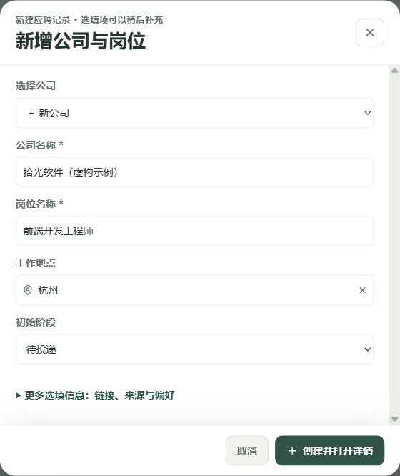
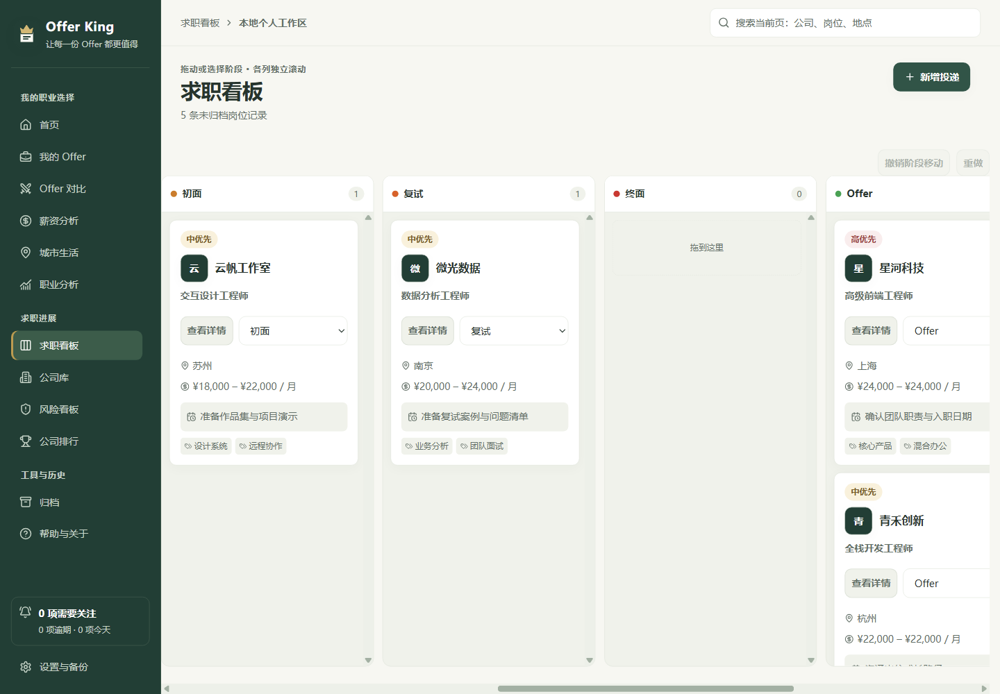
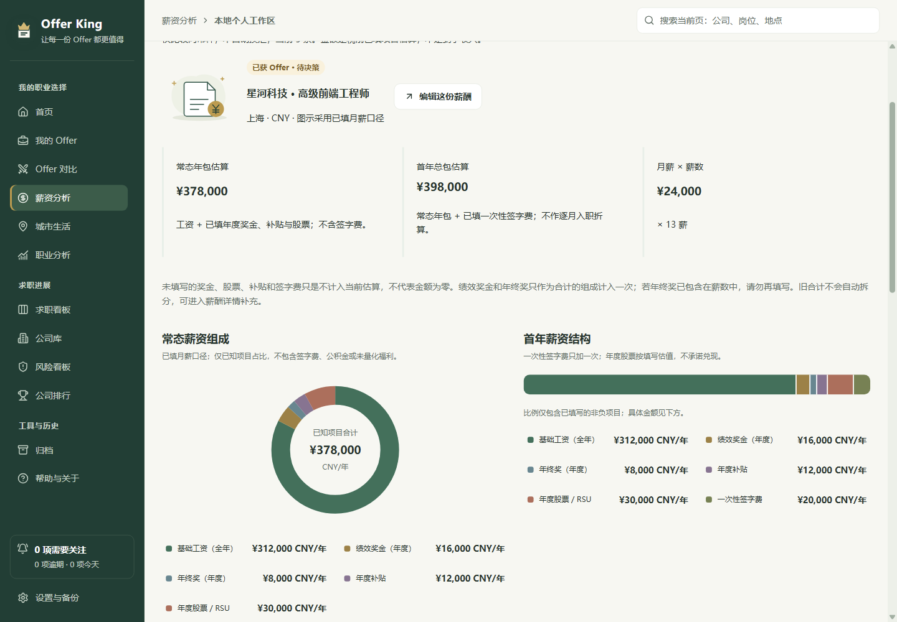
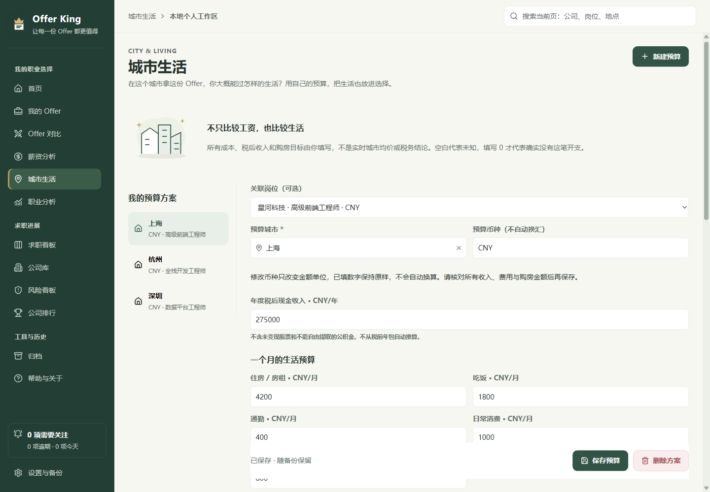
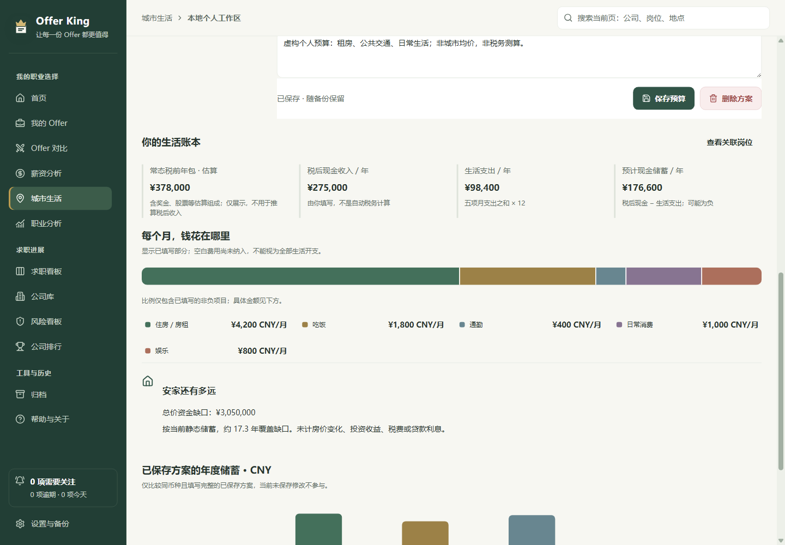
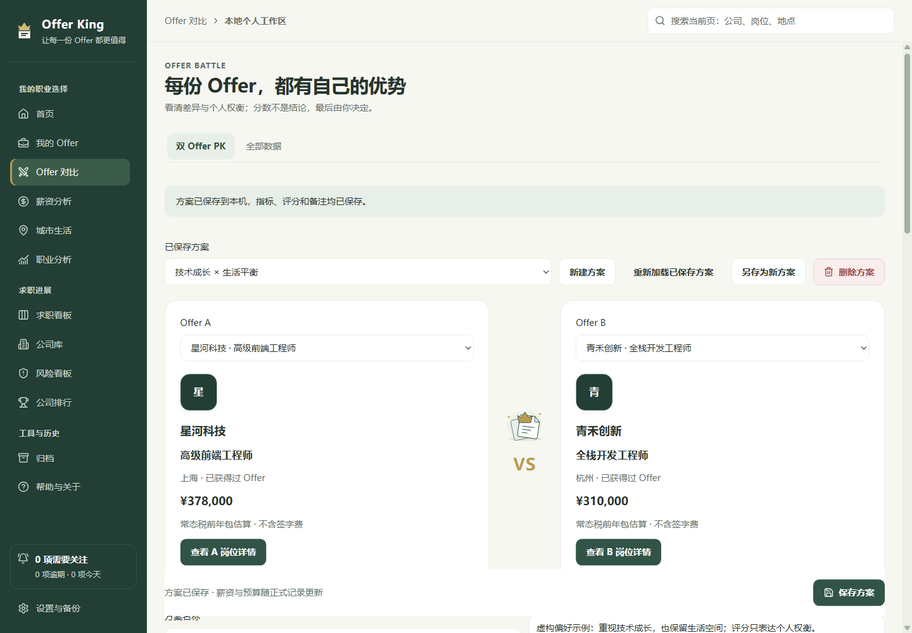
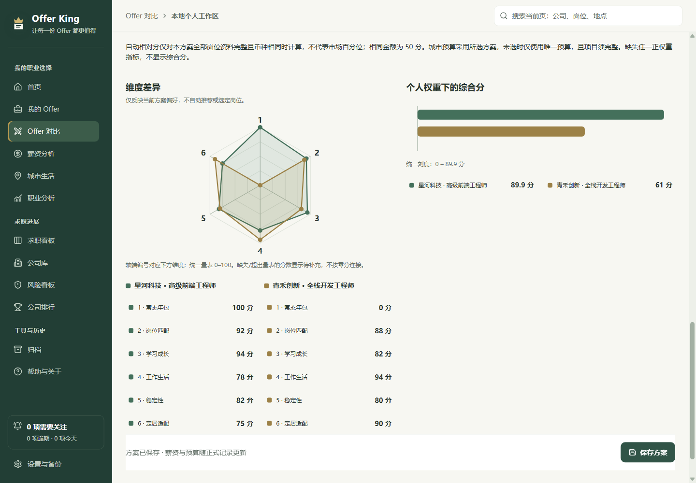
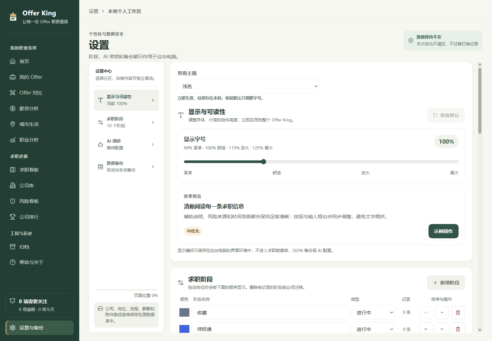
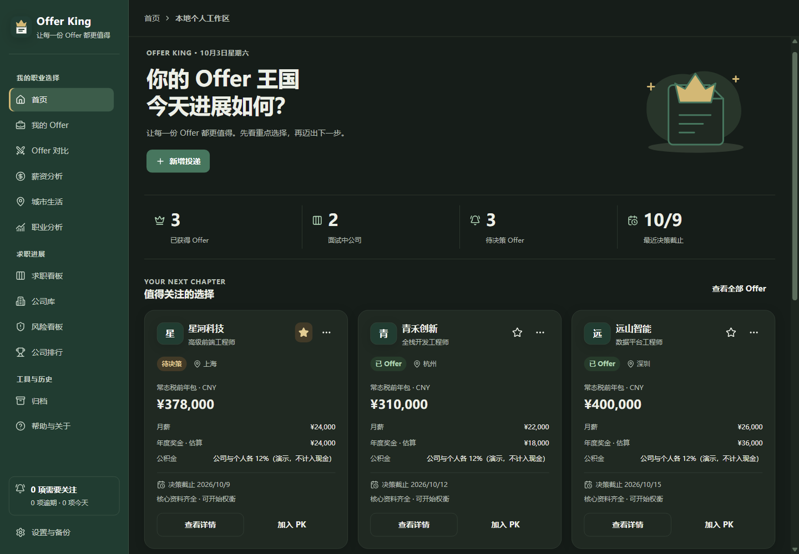

# Offer King 图文上手指南

[返回首页](../README.md) · [常见问题](FAQ.md) · [数据与隐私](PRIVACY.md)

从记录第一条投递开始，不需要一次把所有内容填完。本指南对应 **2.0.0 / Windows x64**，图片使用演示数据；刚安装的应用会从你自己的空白记录开始。

## 1. 下载并安装

打开 [Releases 发布页](https://github.com/YCC-Lover/Offer-King/releases/latest)，在 **Assets** 中选择 `Offer-King-Setup-2.0.0.exe`。不需要下载 `Source code` 压缩包，也不需要安装开发工具。

本版面向 Windows 10 / 11 x64，应用最小窗口为 1100 × 700。手机浏览文档没问题，但目前没有可安装的手机版。

### 安装前先核对

本版安装包未进行数字签名，Windows 可能提示未知发布者。请确认来自上面的仓库，并核对文件校验值。不要关闭 Defender、SmartScreen 等安全防护；系统持续拦截时，请停止安装并 [报告问题](https://github.com/YCC-Lover/Offer-King/issues/new?template=bug_report.yml)。

在安装包所在文件夹打开 PowerShell，运行：

```powershell
Get-FileHash -Algorithm SHA256 -LiteralPath '.\Offer-King-Setup-2.0.0.exe'
```

2.0.0 这一份安装包的大小为 **111,665,351 字节**，SHA-256 应为：

```text
B1E426DBB5A748C2A54ACEE9EF7C878B6A938F7CA8DDEA440D51FC4D02886210
```

哈希只能核对文件是否一致，不能代替可信来源与数字签名。其他版本应核对对应发布页，不能套用这个值。

核对后，按安装向导完成安装。真实干净 Windows 环境中的首次安装和覆盖升级尚未完成验证；如果出现异常，请保留现状，不要清空应用数据。

### 已经用过旧版？先备份

先在旧版“设置与备份”中导出 JSON，妥善保存，然后关闭旧版。更新时保留原安装位置，不要为了升级先清空数据或卸载。启动新版后，核对原来的公司、岗位与 AI 配置状态，并继续保留升级前的备份。

部分内部文件名仍沿用原名称，这是为保留原有数据兼容性；请不要自行改名或移动应用数据。

## 2. 建立第一条投递



1. 在欢迎页点击“新增第一条投递”；已有记录时，也可以在求职看板点击“新增投递”，或按 `Ctrl+N`。
2. 选择“＋ 新公司”，填写“公司名称”和“岗位名称”。例如：公司填“示例科技”，岗位填“产品经理”。
3. 按实际情况选择“工作地点”和“初始阶段”。公司官网、岗位链接和来源可以展开“更多选填信息：链接、来源与偏好”补充，也可以以后再填。
4. 点击“创建并打开详情”。

同一家公司有多个岗位时，直接在“选择公司”中复用已有公司即可，不必为每个岗位重复建公司档案。

**做完后检查：** 岗位详情能够打开，求职看板中也能找到对应卡片。这里不需要配置 AI。

## 3. 让下一步有着落



在岗位详情中填写“下一事项”和提醒时间，例如“确认下一轮面试时间”，然后点击“保存全部更改”。回到首页，就能按逾期、今天和未来七天查看待办。

面试有进展时，可以把看板卡片拖到对应阶段，也可以使用卡片上的阶段选择菜单。完成待办和推进阶段是两件事：“完成事项”会记录流程，但不会替你改变求职阶段。

需要保留面试过程时，在详情中添加流程记录。请注意，尚未添加的流程记录要单独提交，不会被“保存全部更改”一并添加。

**提醒边界：** 待办仅在应用内显示，不是关闭应用后仍运行的系统闹钟。

## 4. 拿到 Offer 后，补齐决策信息

打开“我的 Offer”整理重点机会。收藏可以帮助你快速找到关心的岗位；在岗位详情里记录“Offer 决策状态”和“Offer 决策截止”，再点击“保存全部更改”。

如果决策字段暂不可选，请先核对这条岗位是否已经处于获得 Offer 的阶段。还在面试时可以记录意向薪资，但不应把它当成已经拿到的正式 Offer。

决策截止与“下一事项”的提醒时间相互独立。超过截止时间不会自动把 Offer 改成失效；“标记最终选择”也只是个人标记，不会替你接受这一份或拒绝其他 Offer。

## 5. 先把薪酬的口径填对



进入岗位详情的“薪酬福利”，按 Offer 原文填写月薪、一年薪数、奖金、股票、补贴等信息。点击“保存薪酬福利”或“保存全部更改”，再到“薪资分析”查看结果；也可以从分析页点击“编辑这份薪酬”返回修改。

几个容易弄混的地方：

- **常态年包**不含签字费，**首年总包**包含签字费；两者都是基于已填写资料的估算。
- **年度奖金**是合计，“绩效奖金（年度，可选）”和“年终奖（年度，可选）”是其中的明细，不会再额外加一次。
- 例如年度奖金为 30,000，其中绩效 10,000、年终 20,000：填写合计和两项明细后，计入年包的奖金仍是 30,000。
- 如果年终奖已经包含在“一年薪数”里，不要再次填入奖金，避免自己重复记账。
- 不知道的项目可以留空；填 `0` 表示已经确认没有。旧资料中的奖金合计不会被自动猜测拆分。
- 公积金、福利和未变现股票不等于手上可花的现金。不同币种不会自动换汇比较。

页面中的年度涨幅试算由你临时设置，不保存，也不代表收入预测。

## 6. 为城市生活留一份预算



1. 打开“城市生活”，点击“新建预算”。
2. 选择“关联岗位（可选）”，填写预算城市与币种。如果之后想在 PK 中使用这份预算，请关联对应岗位。
3. 填写“年度税后现金收入”，注意单位是**每年**。应用不会从税前年包自动计算个税，也不会替你估算税后收入。
4. 按**每月**填写租房、饮食、通勤、日常和娱乐预算。没有这笔开支就填 `0`；留空表示尚未确认，可能因此无法计算完整储蓄。
5. 如有需要，在“个人假设与备注”说明合租、通勤方式等条件，然后点击“保存预算”。

举个纯演示的例子：税后现金 180,000 / 年，五项月支出合计 6,000，那么按这些输入计算的年度储蓄为 108,000。这只是输入条件下的算术结果，不是收入或物价承诺。



可以为同一城市保存不同生活方式，或为同一岗位保留多份预算。币种变更只改金额单位，原数字不会自动换算，请重新核对所有金额。

## 7. 做一次属于自己的双 Offer PK



1. 打开“Offer 对比 → 双 Offer PK”。至少有两份不同岗位，才能保存双 Offer 方案；尚在面试的岗位也能参与，但不代表已经收到 Offer。
2. 在“Offer A”和“Offer B”中选出要比较的两份岗位，给方案起一个便于认出的名字。
3. 调整“你的指标，你的权重”。个人评分范围为 0–100，越高代表越符合你的偏好；可以增加或移除指标。
4. 如果采用“预计储蓄相对分”，核对两边的城市预算选择。一个岗位有多份预算时，需要你明确选择；只有一份时可使用唯一预算。
5. 写下个人备注，点击“保存方案”。需要尝试另一组权重时，可以“另存为新方案”，再点击保存。

缺少必要信息时，图表可能显示“待补充”或不显示综合分，这是在提醒你补足信息。自动相对分只在数据完整、币种一致时计算，也不代表市场薪酬排名。



保存的方案会读取岗位与预算的最新正式资料重新计算，不是锁定当时金额的历史快照。

**请记得点保存：** PK 和城市预算有正常离开、退出时的未保存提醒，但未保存输入暂不支持崩溃或异常重启恢复。

## 8. 做好备份，再慢慢完善


打开“设置与备份”，选择“数据备份”：

- 点击“导出 JSON”，选一个你自己能妥善保管的位置。这份文件可能包含公司、薪酬、备注等私人资料，不要发到公开 Issue。
- 查看“最近成功备份”。如果没有成功记录或出现错误，点击“立即备份 / 重试”并确认结果。
- 换电脑或恢复资料时，点击“合并导入”。先查看新增、相同和冲突的预览；冲突默认保留本机，勾选才覆盖，再点击“确认合并导入”。

自动备份是本机按日号轮换的 31 个槽位，不是永久历史存档。它无法防止整机或硬盘损坏，重要资料请另存到自己选择的安全位置。

JSON 包含已保存的求职记录、PK 和城市预算，但不包含 API Key、未提交草稿和附件文件本身。换电脑时，请另外迁移附件并重新配置自己的 AI 密钥。旧备份可以导入；请保留当前版本导出的完整备份，不要把旧版再次导出的文件当成新资料的唯一副本。

## 9. 按你的习惯调整界面





“设置与备份 → 显示与可读性”支持浅色、深色、跟随系统，以及 90%–125% 字号。觉得文字偏小，可以先试 115%。主题和字号只影响显示，不会改变求职记录。

卡片多时，各列可以独立上下滚动；看板底部可左右滚动。某页找不到记录时，先检查搜索条件、筛选、当前页和归档状态。

常用快捷键：`Ctrl+N` 新增投递；`Ctrl+F` 搜索当前页面（首页会转到求职看板，设置与帮助页无搜索框）；`Ctrl+S` 保存当前岗位 / 公司资料或提交新建投递。PK、预算、流程添加及 AI 预览请使用对应按钮，不要把快捷键当成所有操作的统一提交方式。

## AI 可以以后再配

不配置 AI，也能使用记录、比较和备份。需要时再进入“设置与备份 → AI 调研”，配置你自己的密钥；不要把密钥发给其他人。

公司综合调研与岗位 / 风险调研使用的服务不同，请按应用内对应说明配置。主动调研和连接测试都可能产生服务商费用，使用前先了解账户额度。AI 结果请查看来源并核实，不要直接当作事实。

[了解 AI 会发送哪些信息 →](PRIVACY.md#2-哪些操作会联网)

## 遇到问题怎么办？

先不要清空数据。保留已有备份，记下版本、系统、具体操作和错误提示；查看 [常见问题](FAQ.md)，或使用 [问题反馈表](https://github.com/YCC-Lover/Offer-King/issues/new?template=bug_report.yml)。

应用内“帮助与关于”提供反馈模板和“导出脱敏诊断”。公开发送前，请再检查截图和文件，不要附上个人求职资料、密钥或完整备份。

先把第一条记录留下来就好，其他信息可以随着求职进展慢慢补齐。
